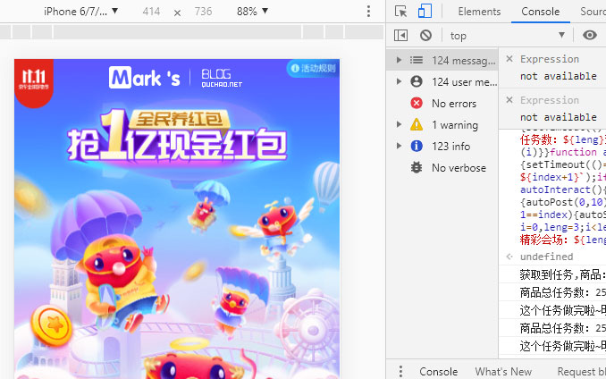
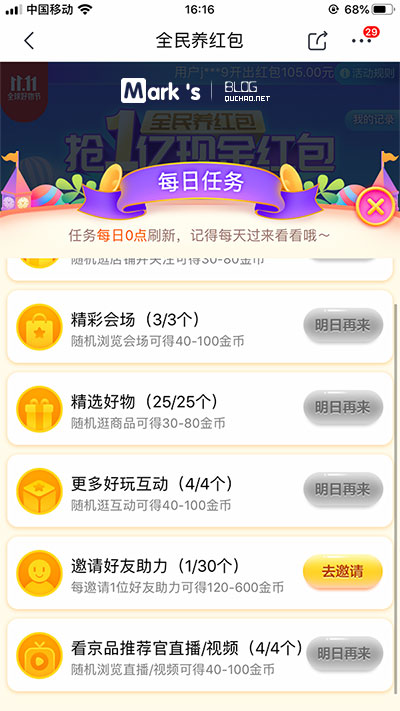

# jd1111aoutScript
京东双十一，活动自动浏览脚本
【交流QQ 908701702 】
双十一 京东全民养红包活动自动脚本

前言
11.11又来了，这次又来送福利了，各个平台的活动也不少，这次给大家送上京东全民养红包活动自动脚本！
教程
1、首先在电脑浏览器打开 
http://www.jd.com

 登录京东账号
2、然后用电脑浏览器 打开https://happy.m.jd.com/babelDiy/GZWVJFLMXBQVEBDQZWMY/XJf8bH6oXDWSgS91daDJzXh9bU7/index.html 进入活动页面
3、按F12 点击
Console

 输入以下代码 之后按一下回车键 就会自动完成了。(图中以Chrome浏览器为例)

let productList = [],
    shopList = [],
    url = "https://api.m.jd.com/client.action";

function autoPost(id, type) {
    fetch(`${url}?timestamp=${new Date().getTime()}`, {
        method: "POST",
        mode: "cors",
        credentials: "include",
        headers: {
            "Content-Type": "application/x-www-form-urlencoded"
        },
        body: `functionId=raisepacket_collectScore&body={"type":${type},"ext":"${id}","appsign":1,"msgsign":2}&client=wh5`
    }).then(function (response) {
        return response.json()
    }).then(function (res) {
        console.log(res.data.biz_msg)
    })
}

function start() {
    fetch(`${url}?${new Date().getTime()}`, {
        method: "POST",
        mode: "cors",
        credentials: "include",
        headers: {
            "Content-Type": "application/x-www-form-urlencoded"
        },
        body: 'functionId=raisepacket_getShopAndProductList&body=&client=wh5'
    }).then(function (response) {
        return response.json()
    }).then(function (res) {
        productList = res.data.result.productList;
        shopList = res.data.result.shopList;
        console.log(`获取到任务,商品：${productList.length}商品：${shopList.length}`);
        autoProductTask()
    })
}

function autoProductTask() {
    for (let i = 0, leng = productList.length; i < leng; i++) {
        (function (index) {
            setTimeout(() => {
                let item = productList[index];
                autoPost(item['id'], 4);
                console.log(`商品总任务数：${leng}当前任务数：${index+1}`);
                if (leng - 1 == index) {
                    autoShopTask()
                }
            }, index * 1500)
        })(i)
    }
}

function autoShopTask() {
    for (let i = 0, leng = shopList.length; i < leng; i++) {
        (function (index) {
            setTimeout(() => {
                let item = shopList[index];
                autoPost(item['id'], 2);
                console.log(`商铺总任务数：${leng}当前任务数：${index+1}`);
                if (leng - 1 == index) {
                    autoPlay()
                }
            }, index * 1500)
        })(i)
    }
}

function autoPlay() {
    for (let i = 0, leng = 4; i < leng; i++) {
        (function (index) {
            setTimeout(() => {
                autoPost(0, 5);
                console.log(`好玩互动：${leng}当前任务数：${index+1}`);
                if (leng - 1 == index) {
                    autoInteract()
                }
            }, index * 1000)
        })(i)
    }
}

function autoInteract() {
    for (let i = 0, leng = 4; i < leng; i++) {
        (function (index) {
            setTimeout(() => {
                autoPost(0, 10);
                console.log(`视频直播：${leng}当前任务数：${index+1}`);
                if (leng - 1 == index) {
                    autoShopping()
                }
            }, index * 1000)
        })(i)
    }
}

function autoShopping() {
    for (let i = 0, leng = 3; i < leng; i++) {
        (function (index) {
            setTimeout(() => {
                autoPost(0, 3);
                console.log(`精彩会场：${leng}当前任务数：${index+1}`)
            }, index * 1000)
        })(i)
    }
}
start();

出处 https://www.quchao.net/JD-20191111.html
